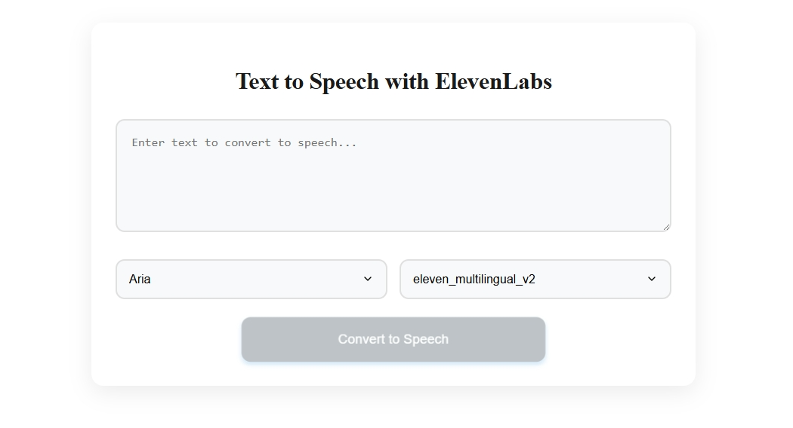

# ElevenLabs Text-to-Speech Angular App

A modern Angular application that demonstrates the capabilities of the ElevenLabs Text-to-Speech API. This project allows you to convert text to natural-sounding speech using various voices and models.

## Screenshots

### Desktop View


## Features

- Convert text to speech using ElevenLabs API
- Select from multiple voices and models
- Play, pause, and stop audio playback
- Modern, responsive UI
- Real-time audio state management

## Technologies Used

- **Angular 17+**: Modern frontend framework
- **TypeScript**: Type-safe JavaScript
- **ElevenLabs API**: State-of-the-art text-to-speech service
- **CSS3**: Modern styling with animations

## Getting Started

### Prerequisites

- Node.js (v16+)
- npm or yarn
- ElevenLabs API key

### Installation

1. Clone the repository:
   ```bash
   git clone https://github.com/yourusername/text-to-speech-elevenlabs.git
   cd text-to-speech-elevenlabs
   ```

2. Install dependencies:
   ```bash
   npm install
   ```

3. Configure your ElevenLabs API key:
   - Open `src/environments/environment.ts` and `src/environments/environment.prod.ts`
   - Replace the placeholder API key with your actual ElevenLabs API key:
     ```typescript
     elevenLabsApiKey: 'your_api_key_here'
     ```

4. Start the development server:
   ```bash
   ng serve
   ```

5. Open your browser and navigate to `http://localhost:4200`

## API Key Configuration

To use the ElevenLabs API, you need to:

1. Create an account at [ElevenLabs](https://elevenlabs.io/)
2. Generate an API key from [API Keys page](https://elevenlabs.io/app/settings/api-keys)
3. Update the API key in the environment files:
   - `src/environments/environment.ts` (for development)
   - `src/environments/environment.prod.ts` (for production)

## Troubleshooting

If you encounter issues with the API:

1. **IP Blocking**: If your IP is blocked, you may need to:
   - Log in to [ElevenLabs](https://elevenlabs.io/) and verify your account
   - Use a different network (like mobile hotspot)
   - Contact ElevenLabs support

2. **Free Tier Limitations**: 
   - The free tier has usage limitations
   - You can still use API keys with the free tier
   - For more information, visit [ElevenLabs Quickstart](https://elevenlabs.io/docs/quickstart)

## License

This project is free to use and open source. Feel free to modify and distribute it as needed.

## Contact

For questions or support, contact:
- Email: deepakchettri877@gmail.com
- Created by: D Loc using AI partners

## Acknowledgments

- [ElevenLabs](https://elevenlabs.io/) for their amazing text-to-speech API
- Angular team for the excellent framework
